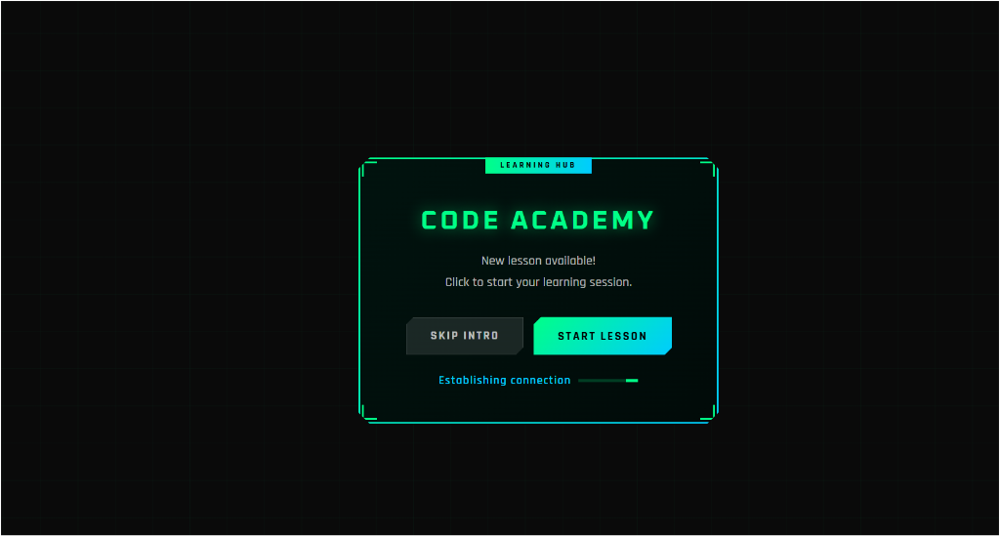
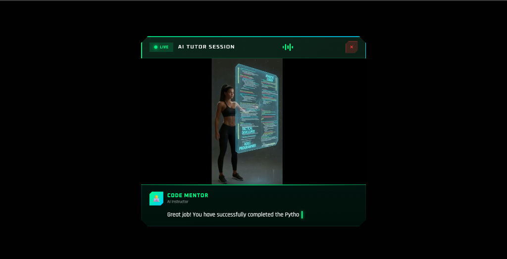

# HeyGen Avatar Alert

**AI Avatar speaks text to replace standard UI alerts.**

---

## What This Does

- Uses HeyGen API to generate an AI avatar video
- Avatar speaks alert messages instead of text popups
- Gaming-style UI with visual effects

---

## Prerequisites

| Requirement | Details |
|-------------|---------|
| Python | 3.8+ |
| Browser | Chrome / Edge / Firefox |

---

## Steps to Run

```bash
# 1. Clone the repo
git clone <repo-url>
cd HeyGen_Manager_Task

# 2. Navigate to demo folder
cd jquery_demo

# 3. Start local server
python -m http.server 8083

# 4. Open in browser
# http://127.0.0.1:8083/
```

---

## Output

### Initial UI


### Avatar Speaking


---

## Features

- ✅ Avatar video with audio
- ✅ Gaming-style UI (neon borders, animations)
- ✅ Typing animation for subtitles
- ✅ Audio visualizer indicator

---

## Project Structure

```
HeyGen_Manager_Task/
├── README.md
├── jquery_demo/
│   ├── index.html
│   ├── avatar_alert.js
│   ├── real.mp4
│   └── screenshots/
└── python_implementation/
    ├── app.py
    └── .env
```


