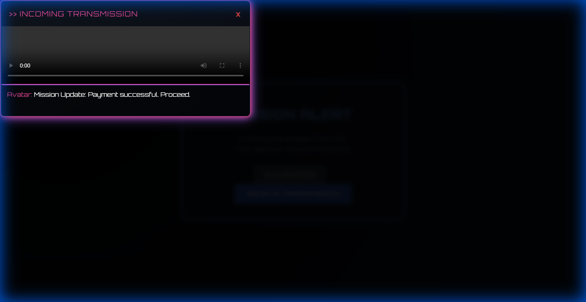

# HeyGen Avatar Alert (PoC)

This project replaces the standard browser `alert()` with a "Gamified" Avatar Video Modal using jQuery and HeyGen.

## 📂 Project Structure
- **`jquery_demo/`**: The main deliverable. Contains the frontend logic (`index.html`, `avatar_alert.js`).
- **`python_implementation/`**: Backend reference code (Flask proxy).

## 📸 Screenshots

### 1. Loading State
*"Connecting to HQ..." - The system initiates the API call.*

### 2. Final Output
*The Avatar delivers the mission update in a Sci-Fi UI.*

## 🚀 How to Run (Step-by-Step)
You can run the demo directly in your browser.

1. **Download/Clone** this repository.
2. Navigate to the `jquery_demo` folder.
3. Open `index.html` in any web browser (Chrome, Edge, etc.).
4. Click the **"RECEIVE TRANSMISSION"** button.
   - You will see a loading state.
   - A Sci-Fi/Gamer style modal will pop up.
   - The avatar video will autoplay with a mission update.

## 🛠 Integration Logic
1. **Trigger**: User clicks a button.
2. **API Call**: `avatar_alert.js` simulates an async call to HeyGen API (mocked for instant demo).
3. **Render**: jQuery handles the UI updates (Loading State → Modal Display → Video Injection).

## 📝 Note
This is a Proof of Concept. In a live production environment, the `callHeyGenAPI` function in `avatar_alert.js` would use `fetch()` or `$.ajax()` to hit your backend proxy.
