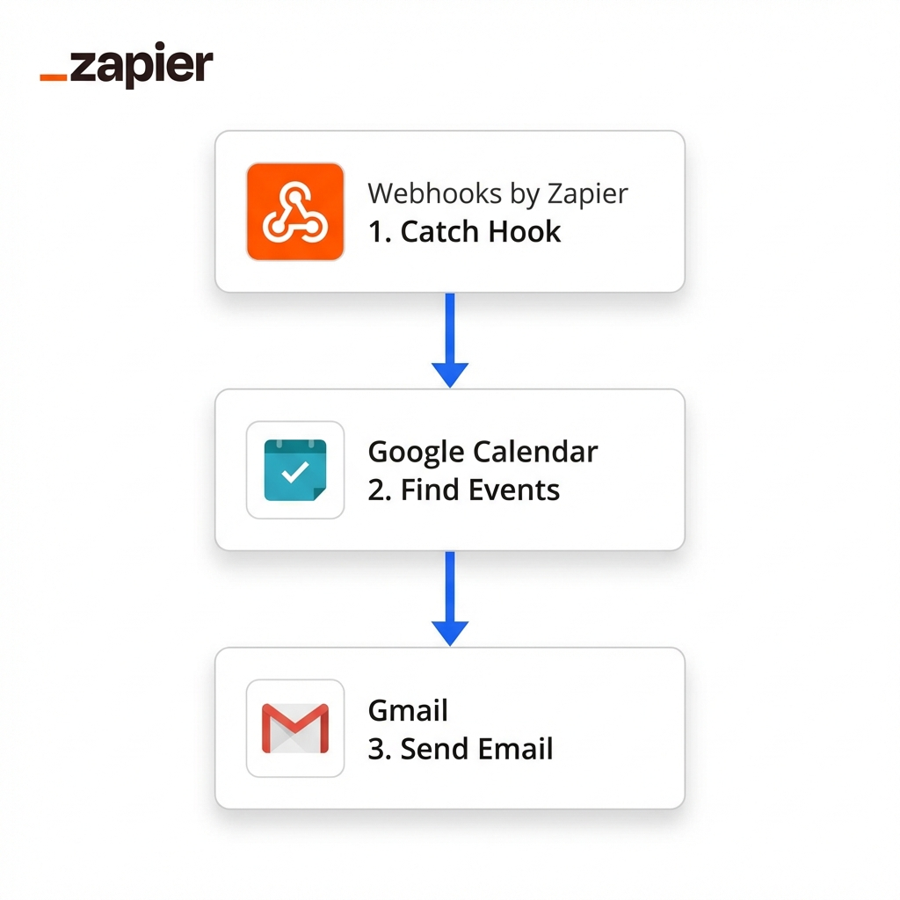

# 🤖 Digital Employee PoC Guide

This project implements a "Digital Employee" that acts as a bridge between a User and their apps (Gmail/Calendar) via Zapier.

## 🏗️ Architecture



```mermaid
graph LR
    User[User Query] -->|HTPP Request| AI[AI Brain (FastAPI)]
    AI -->|Analyze Intent| Decision{Decision}
    Decision -->|'check_calendar'| Zap1[Zapier Webhook A]
    Decision -->|'summarize_emails'| Zap2[Zapier Webhook B]
    
    Zap1 -->|Find Events| GCal[Google Calendar]
    Zap1 -->|Send Report| UserEmail[User's Email]
    
    Zap2 -->|Search Emails| Gmail[Gmail]
    Zap2 -->|Send Summary| UserEmail
```

---

## 🚀 Step 1: Zapier Setup

You need to create **two** separate Zaps (or one advanced Zap with Paths) to handle the requests.

### Zap A: The Calendar Assistant
1.  **Trigger**: Webhooks by Zapier (Catch Hook)
    *   Copy the `Webhook URL`. run the python script once to test it, and then "Continue".
2.  **Action**: Google Calendar (Find Events)
    *   Search Query: Use input from the webhook (e.g., `time_min`, `time_max`).
3.  **Action**: Gmail (Send Email)
    *   To: Your email address.
    *   Subject: "Your Calendar Query Result"
    *   Body: Insert the found events from step 2.

### Zap B: The Email Assistant
1.  **Trigger**: Webhooks by Zapier (Catch Hook)
    *   Copy the `Webhook URL`.
2.  **Action**: Gmail (Find Emails)
    *   Search Query: `label:inbox is:unread` (or whatever the AI decided).
3.  **Action**: Gmail (Send Email) (Yes, email yourself about emails!) or Slack (Send Channel Message).
    *   Body: List the subject lines found in step 2.

---

## 💻 Step 2: Local Setup

1.  **Install Dependencies**:
    ```bash
    pip install -r requirements.txt
    ```

2.  **Configure Environment**:
    Create a `.env` file with:
    ```ini
    GOOGLE_API_KEY=your_gemini_key
    ZAPIER_CALENDAR_HOOK=https://hooks.zapier.com/hooks/catch/12345/abcde
    ZAPIER_EMAIL_HOOK=https://hooks.zapier.com/hooks/catch/12345/fghij
    ```

3.  **Run the Brain**:
    ```bash
    python brain.py
    ```

## 🧪 Step 3: Usage

**Ask your employee a question:**

```bash
# Using curl (or Postman)
curl -X POST "http://localhost:8000/ask" \
     -H "Content-Type: application/json" \
     -d '{"query": "Do I have any meetings today?"}'
```

**Expected Result**:
1.  Server prints: "Intent: check_calendar"
2.  Server sends webhook to Zapier.
3.  Zapier runs, finds events, and emails you the list.
