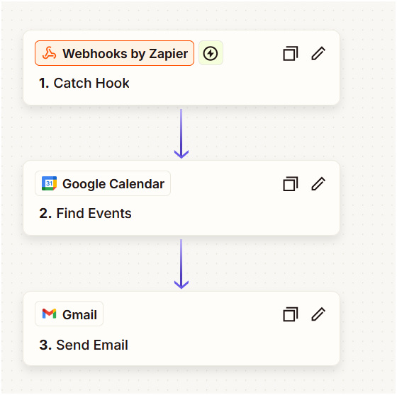
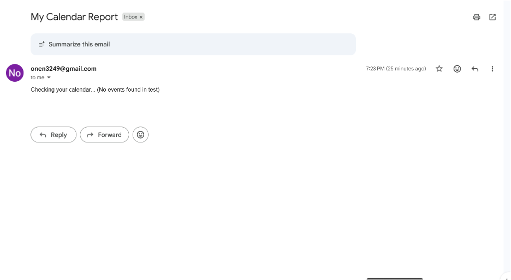

# Digital Employee PoC Guide

This project implements a **"Digital Employee"** that acts as an intelligent bridge between a User and their apps (Gmail/Calendar) via Zapier. The AI-powered brain analyzes user queries, determines intent, and triggers appropriate automation workflows.

---

## Technologies Used

| Technology | Purpose |
|------------|---------|
| **Python 3.8+** | Primary programming language |
| **FastAPI** | Web framework for building the REST API |
| **Uvicorn** | ASGI server to run the FastAPI application |
| **LangChain** | Framework for building AI applications |
| **Google Gemini (gemini-2.0-flash)** | LLM for intent classification |
| **Pydantic** | Data validation and settings management |
| **Zapier Webhooks** | Automation platform for Gmail/Calendar actions |
| **python-dotenv** | Environment variable management |

---

## Prerequisites

Before running this project, ensure you have:

1. **Python 3.8 or higher** installed
2. **Google Gemini API Key** - Get it from [Google AI Studio](https://aistudio.google.com/)
3. **Zapier Account** - Free tier works for testing
4. **Gmail & Google Calendar** accounts connected to Zapier

---

## Project Structure

```
Digital_Employee_PoC/
├── brain.py            # Main FastAPI application with AI logic
├── requirements.txt    # Python dependencies
├── .env                # Environment variables (not tracked in git)
├── .env.example        # Example environment configuration
├── .gitignore          # Git ignore rules
├── test_poc.py         # Test script for the PoC
├── images/             # Screenshots for documentation
│   ├── zapier_workflow.png
│   └── email_result.png
└── README.md           # This file
```

---

## How to Run

### Step 1: Clone & Install Dependencies

```bash
# Navigate to the project directory
cd Digital_Employee_PoC

# Create a virtual environment (recommended)
python -m venv venv

# Activate virtual environment
# On Windows:
venv\Scripts\activate
# On macOS/Linux:
source venv/bin/activate

# Install dependencies
pip install -r requirements.txt
```

### Step 2: Configure Environment Variables

1. Copy the example environment file:
   ```bash
   cp .env.example .env
   ```

2. Edit `.env` with your credentials:
   ```ini
   GOOGLE_API_KEY=your_gemini_api_key_here
   ZAPIER_CALENDAR_HOOK=https://hooks.zapier.com/hooks/catch/xxxxx/xxxxx
   ZAPIER_EMAIL_HOOK=https://hooks.zapier.com/hooks/catch/xxxxx/xxxxx
   ```

### Step 3: Run the Application

```bash
python brain.py
```

The server will start at `http://localhost:8000`

### Step 4: Test the API

```bash
# Using curl
curl -X POST "http://localhost:8000/ask" \
     -H "Content-Type: application/json" \
     -d '{"query": "Do I have any meetings today?"}'
```

---

## Architecture

```
┌─────────────┐     ┌─────────────────┐     ┌─────────────┐     ┌──────────────┐
│    User     │────▶│  FastAPI Brain │────▶│   Zapier    │────▶│ Gmail/Calendar│
│  (Query)    │     │  (Gemini LLM)   │     │  (Webhook)  │     │   (Action)   │
└─────────────┘     └─────────────────┘     └─────────────┘     └──────────────┘
```

---

## Zapier Setup

You need to create **two** separate Zaps (or one advanced Zap with Paths) to handle the requests.

### Zap A: The Calendar Assistant
1.  **Trigger**: Webhooks by Zapier (Catch Hook)
    *   Copy the `Webhook URL`. run the python script once to test it, and then "Continue".
2.  **Action**: Google Calendar (Find Events)
    *   Search Query: Use input from the webhook (e.g., `time_min`, `time_max`).
3.  **Action**: Gmail (Send Email)
    *   To: Your email address.
    *   Subject: "Your Calendar Query Result"
    *   Body: Insert the found events from step 2.

### Zap B: The Email Assistant
1.  **Trigger**: Webhooks by Zapier (Catch Hook)
    *   Copy the `Webhook URL`.
2.  **Action**: Gmail (Find Emails)
    *   Search Query: `label:inbox is:unread` (or whatever the AI decided).
3.  **Action**: Gmail (Send Email) (Yes, email yourself about emails!) or Slack (Send Channel Message).
    *   Body: List the subject lines found in step 2.

---

## Expected Result

When you send a query to the API:
1. Server prints: `Receiving query: ...` and `AI Decision: check_calendar | Params: today`
2. Server sends webhook to Zapier
3. Zapier runs, finds events, and emails you the list

---

## Screenshots - Task Completed ✅

Here is the progress and proof of the working Digital Employee PoC:

### Zapier Workflow Setup
<p align="center">
  
</p>

### Email Result Received
<p align="center">
  
</p>
