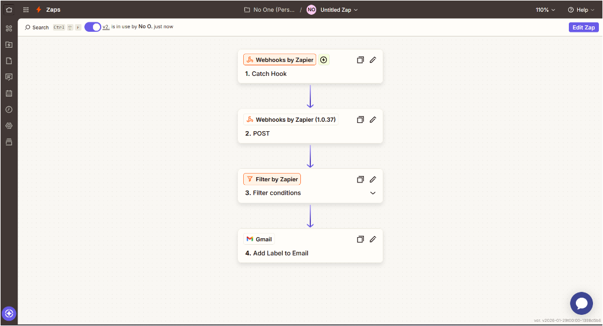
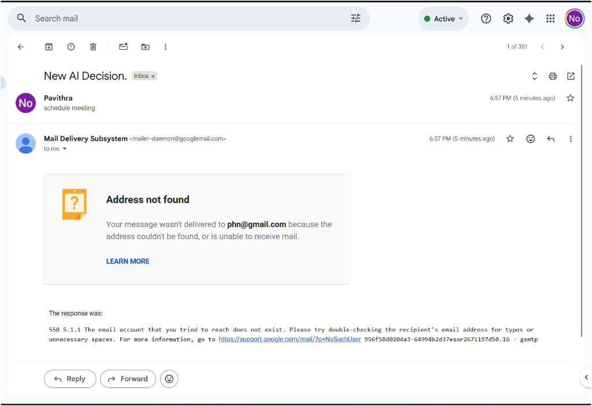

# 🔗 Zapier Integration Guide

## Overview

**Zapier** is the world's largest automation platform that connects over 6,000+ apps to automate workflows without writing code. It's a powerful AI-powered tool that helps businesses and individuals streamline their operations by creating automated "Zaps" between different applications.


---

## 📋 Table of Contents

1. [What is Zapier?](#what-is-zapier)
2. [Key Features](#key-features)
3. [Getting Started](#getting-started)
4. [Gmail Integration](#gmail-integration)
5. [Google Calendar Integration](#google-calendar-integration)
6. [AI Decision Integration](#ai-decision-integration)
7. [Popular Zap Templates](#popular-zap-templates)
8. [Advanced Automations](#advanced-automations)
9. [Best Practices](#best-practices)
10. [Troubleshooting](#troubleshooting)

---

## 🤖 What is Zapier?

Zapier is an **AI-powered automation platform** that enables you to:

- **Connect Apps**: Link 6,000+ apps together seamlessly
- **Automate Tasks**: Create automated workflows called "Zaps"
- **Save Time**: Eliminate repetitive manual tasks
- **No Code Required**: Build automations through a visual interface
- **AI Integration**: Leverage AI to enhance automation capabilities

### Core Concepts

| Term | Description |
|------|-------------|
| **Zap** | An automated workflow that connects two or more apps |
| **Trigger** | The event that starts a Zap (e.g., "New email in Gmail") |
| **Action** | What happens after the trigger (e.g., "Create calendar event") |
| **Task** | Each successful action run counts as one task |
| **Multi-step Zaps** | Zaps with multiple sequential actions |

---

## ⭐ Key Features

### 1. **AI-Powered Automation**
- Natural language Zap creation
- Smart recommendations for workflows
- AI-assisted troubleshooting

### 2. **Visual Workflow Builder**
- Drag-and-drop interface
- Conditional logic (Paths)
- Filters and formatters

### 3. **6,000+ App Integrations**
- Google Workspace (Gmail, Calendar, Docs, Sheets)
- Microsoft 365
- Slack, Discord, Trello
- CRM systems (Salesforce, HubSpot)
- And many more...

### 4. **Enterprise Features**
- Team collaboration
- Advanced security
- Custom app connections
- API access

---

## 🚀 Getting Started

### Step 1: Create a Zapier Account

1. Visit [zapier.com](https://zapier.com)
2. Sign up with email or Google account
3. Verify your email address
4. Complete onboarding questionnaire

### Step 2: Connect Your Apps

1. Go to **My Apps** in your dashboard
2. Click **Add Connection**
3. Search for the app you want to connect
4. Authorize Zapier to access your account

### Step 3: Create Your First Zap

1. Click **Create Zap** or **+ Create**
2. Choose a trigger app and event
3. Choose an action app and event
4. Map fields between apps
5. Test and turn on your Zap

---

## 📧 Gmail Integration

See detailed documentation: [Gmail Integration Guide](./Gmail_Integration.md)

### Quick Overview

Gmail integration allows you to:
- **Trigger Zaps** when new emails arrive
- **Send automated emails** as actions
- **Search and organize** emails
- **Create drafts** automatically
- **Apply labels** based on conditions

### Popular Gmail Triggers
- New Email
- New Email Matching Search
- New Labeled Email
- New Attachment
- New Starred Email

### Popular Gmail Actions
- Send Email
- Create Draft
- Add Label to Email
- Reply to Email
- Find Email

---

## 📅 Google Calendar Integration

See detailed documentation: [Google Calendar Integration Guide](./Google_Calendar_Integration.md)

### Quick Overview

Google Calendar integration allows you to:
- **Trigger Zaps** when events are created/updated
- **Create events** automatically
- **Update existing events** 
- **Send reminders** through other apps
- **Sync calendars** with other tools

### Popular Calendar Triggers
- New Event
- Event Start
- Event Cancelled
- New Event Matching Search

### Popular Calendar Actions
- Create Event
- Update Event
- Quick Add Event
- Find Event
- Delete Event

---

## 🧠 AI Decision Integration

See detailed setup guide: [AI Decision Setup](./ai-decision/ZAPIER_SETUP.md)

### Quick Overview

This project includes a custom **AI Decision Server** that acts as a brain for your Zaps.

- **How it works**: Zapier sends text to your local computer -> Gemini 2.0 AI decides the category -> Zapier filters the action.
- **Categories**: `calendar`, `email`, `ignore`.
- **Tech Stack**: Python (FastAPI), Google Gemini AI, Ngrok.

### Key Files in `ai-decision/`
- `main.py`: The Python server code.
- `ZAPIER_SETUP.md`: Step-by-step guide to connecting this to Zapier.
- `test_request.py`: Script to verify the server is working.

### Proof of Concept

*Figure 1: Full Zapier Workflow Configuration*


*Figure 2: Successful Email Notification from AI*

---

## 🎯 Popular Zap Templates

### Email + Calendar Combinations

| Zap | Description |
|-----|-------------|
| Email → Calendar | Create calendar events from emails containing specific keywords |
| Calendar → Email | Send email reminders before calendar events |
| Email → Calendar + Slack | Create events and notify team when client emails arrive |

### Productivity Workflows

1. **Meeting Scheduler**: New email with "meeting" → Create calendar event → Send confirmation
2. **Daily Digest**: Calendar events starting today → Compile → Send daily summary email
3. **Auto-Archive**: Calendar event ends → Archive related emails → Update spreadsheet

---

## 🛠️ Advanced Automations

### Multi-Step Zaps

```
Trigger: New email from specific sender
    ↓
Action 1: Create calendar event
    ↓
Action 2: Add row to Google Sheets
    ↓
Action 3: Send Slack notification
    ↓
Action 4: Reply to original email
```

### Using Filters

Filters allow you to run actions only when specific conditions are met:

- Email subject contains "URGENT"
- Event duration is longer than 1 hour
- Sender email is from @company.com

### Using Paths (Conditional Logic)

Create branching workflows:

```
IF email subject contains "Invoice"
    → Create expense in accounting app
ELSE IF email subject contains "Meeting"
    → Create calendar event
ELSE
    → Archive email
```

---

## 📚 Best Practices

### 1. **Start Simple**
- Begin with 2-step Zaps
- Test thoroughly before adding complexity
- Document your automations

### 2. **Use Descriptive Names**
- Name Zaps clearly: "Gmail to Calendar - Meeting Requests"
- Add descriptions for team members

### 3. **Monitor and Maintain**
- Check Zap history regularly
- Set up error notifications
- Review and update monthly

### 4. **Security Considerations**
- Regularly audit connected apps
- Use appropriate permission levels
- Disconnect unused integrations

### 5. **Optimize for Tasks**
- Use filters to reduce unnecessary triggers
- Combine actions where possible
- Schedule non-urgent Zaps to run less frequently

---

## 🔧 Troubleshooting

### Common Issues

| Issue | Solution |
|-------|----------|
| Zap not triggering | Check app connection, verify trigger settings |
| Missing data in action | Verify field mapping, check for required fields |
| Error on action | Review error message, check app permissions |
| Duplicate actions | Add deduplication filter or adjust trigger |

### Getting Help

1. **Zapier Help Center**: [help.zapier.com](https://help.zapier.com)
2. **Community Forum**: [community.zapier.com](https://community.zapier.com)
3. **Support Ticket**: Available for paid plans
4. **Documentation**: [zapier.com/apps](https://zapier.com/apps)

---

## 📁 Project Structure

```
Zapier_Integration/
├── README.md                          # This file
├── Gmail_Integration.md               # Detailed Gmail guide
├── Google_Calendar_Integration.md     # Detailed Calendar guide
└── ai-decision/                       # 🧠 AI Brain Project
    ├── main.py                        # AI Server (FastAPI)
    ├── ZAPIER_SETUP.md                # Setup Instructions
    ├── requirements.txt               # Python dependencies
    ├── .env                           # API Keys (Local only)
    └── .gitignore                     # Git configuration
```

---

## 📄 License

This documentation is created for educational purposes as part of the internship program.

---

## 👤 Author

**Internship Assignment** - Zapier Integration Study  
*Date: January 2026*
