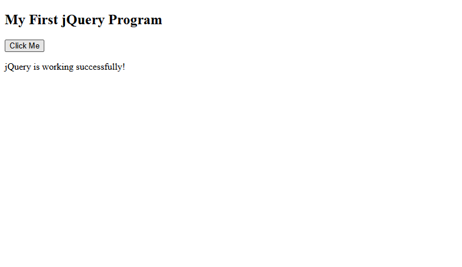
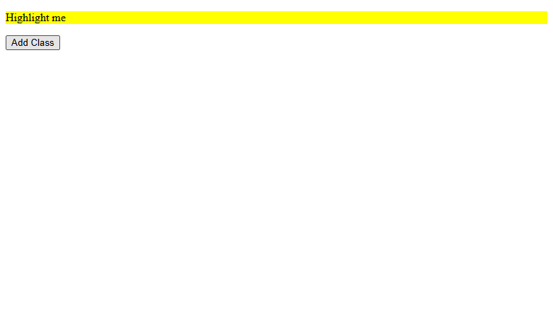
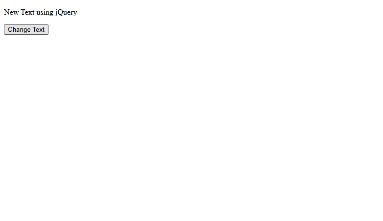
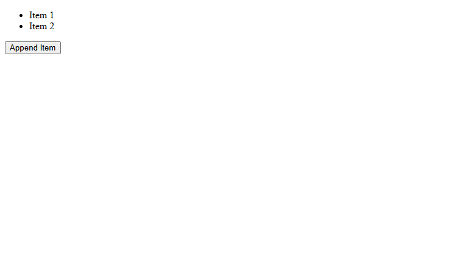
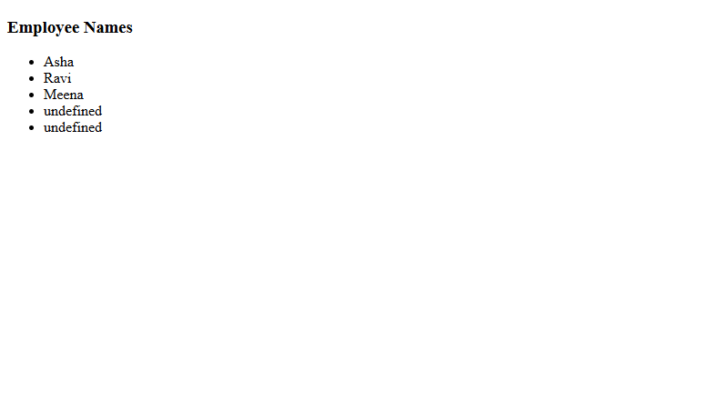
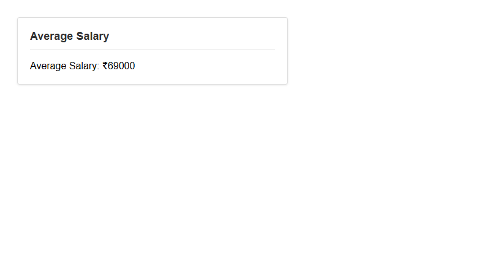

# jQuery Assignment Codes and Outputs

## Code 1
```html
<!-- Hide an Element Using jQuery -->


<!DOCTYPE html>
<html>
<head>
    <title>jQuery Practice</title>

    <!-- jQuery Library -->
    <script src="https://code.jquery.com/jquery-3.7.1.min.js"></script>
</head>
<body>

    <h2>My First jQuery Program</h2>

    <button id="btn">Click Me</button>
    <p id="text">Hello World</p>

    <script>
        $(document).ready(function () {
            $("#btn").click(function () {
                $("#text").text("jQuery is working successfully!");
            });
        });
    </script>

</body>
</html>
```
**Output:**
Displays a heading "My First jQuery Program", a button "Click Me", and text "Hello World".
When the button is clicked, the text "Hello World" changes to "jQuery is working successfully!".



---

## Code 2
```html
<!-- Show an Element -->


<!DOCTYPE html>
<html>
<head>
  <title>jQuery Show</title>
  <script src="https://code.jquery.com/jquery-3.7.1.min.js"></script>
</head>
<body>

<p id="p2" style="display:none;">Hidden paragraph</p>
<button id="showBtn">Show</button>

<script>
$("#showBtn").click(function () {
  $("#p2").show();
});
</script>

</body>
</html>
```
**Output:**
Displays a button "Show". A hidden paragraph exists on the page.
When the button is clicked, the text "Hidden paragraph" appears/becomes visible.


---

## Code 3
```html
<!-- Toggle an Element -->


<!DOCTYPE html>
<html>
<head>
  <title>jQuery Toggle</title>
  <script src="https://code.jquery.com/jquery-3.7.1.min.js"></script>
</head>
<body>

<p id="p3">Toggle me</p>
<button id="toggleBtn">Toggle</button>

<script>
$("#toggleBtn").click(function () {
  $("#p3").toggle();
});
</script>

</body>
</html>
```
**Output:**
Displays text "Toggle me" and a button "Toggle".
When the button is clicked repeatedly, the text alternately disappears (hides) and reappears (shows).


---

## Code 4
```html
<!DOCTYPE html>
<html>
<head>
  <title>jQuery Fade</title>
  <script src="https://code.jquery.com/jquery-3.7.1.min.js"></script>
</head>
<body>

<p id="p4">Fade this text</p>
<button id="fadeBtn">Fade Out</button>

<script>
$("#fadeBtn").click(function () {
  $("#p4").fadeOut();
});
</script>

</body>
</html>
```
**Output:**
Displays text "Fade this text" and a button "Fade Out".
When the button is clicked, the text smoothly fades away until it disappears.


---

## Code 5
```html
<!-- Slide Up -->

<!DOCTYPE html>
<html>
<head>
  <title>jQuery Slide</title>
  <script src="https://code.jquery.com/jquery-3.7.1.min.js"></script>
</head>
<body>

<p id="p5">Slide me up</p>
<button id="slideBtn">Slide Up</button>

<script>
$("#slideBtn").click(function () {
  $("#p5").slideUp();
});
</script>

</body>
</html>
```
**Output:**
Displays text "Slide me up" and a button "Slide Up".
When the button is clicked, the text slides up (collapses vertically) and disappears.


---

## Code 6
```html
<!-- Add Class -->

<!DOCTYPE html>
<html>
<head>
  <title>Add Class</title>
  <script src="https://code.jquery.com/jquery-3.7.1.min.js"></script>
  <style>
    .highlight { background-color: yellow; }
  </style>
</head>
<body>

<p id="p6">Highlight me</p>
<button id="addClassBtn">Add Class</button>

<script>
$("#addClassBtn").click(function () {
  $("#p6").addClass("highlight");
});
</script>

</body>
</html>
```
**Output:**
Displays text "Highlight me" and a button "Add Class".
When the button is clicked, the text gets a yellow background color.



---

## Code 7
```html
<!-- Remove Class -->

<!DOCTYPE html>
<html>
<head>
  <title>Remove Class</title>
  <script src="https://code.jquery.com/jquery-3.7.1.min.js"></script>
  <style>
    .highlight { background-color: yellow; }
  </style>
</head>
<body>

<p id="p7" class="highlight">Remove highlight</p>
<button id="removeClassBtn">Remove Class</button>

<script>
$("#removeClassBtn").click(function () {
  $("#p7").removeClass("highlight");
});
</script>

</body>
</html>
```
**Output:**
Displays text "Remove highlight" which initially has a yellow background.
When the button "Remove Class" is clicked, the yellow background is removed.


---

## Code 8
```html
<!-- Change Text -->

<!DOCTYPE html>
<html>
<head>
  <title>Change Text</title>
  <script src="https://code.jquery.com/jquery-3.7.1.min.js"></script>
</head>
<body>

<p id="p8">Old Text</p>
<button id="textBtn">Change Text</button>

<script>
$("#textBtn").click(function () {
  $("#p8").text("New Text using jQuery");
});
</script>

</body>
</html>
```
**Output:**
Displays text "Old Text" and a button "Change Text".
When the button is clicked, the text changes to "New Text using jQuery".



---

## Code 9
```html
<!-- Change HTML -->

<!DOCTYPE html>
<html>
<head>
  <title>Change HTML</title>
  <script src="https://code.jquery.com/jquery-3.7.1.min.js"></script>
</head>
<body>

<div id="box">Hello</div>
<button id="htmlBtn">Change HTML</button>

<script>
$("#htmlBtn").click(function () {
  $("#box").html("<b>Hello World</b>");
});
</script>

</body>
</html>
```
**Output:**
Displays text "Hello" and a button "Change HTML".
When the button is clicked, the text changes to bold "**Hello World**".


---

## Code 10
```html
<!-- Append-->

<!DOCTYPE html>
<html>
<head>
  <title>Append</title>
  <script src="https://code.jquery.com/jquery-3.7.1.min.js"></script>
</head>
<body>

<ul id="list">
  <li>Item 1</li>
</ul>
<button id="appendBtn">Append Item</button>

<script>
$("#appendBtn").click(function () {
  $("#list").append("<li>Item 2</li>");
});
</script>

</body>
</html>
```
**Output:**
Displays a bulleted list with "Item 1" and a button "Append Item".
When the button is clicked, a new bullet point "Item 2" is added to the list.



---

## Code 11
```html
<!-- Keyup Event -->

<!DOCTYPE html>
<html>
<head>
  <title>Keyup</title>
  <script src="https://code.jquery.com/jquery-3.7.1.min.js"></script>
</head>
<body>

<input type="text" id="inputBox">
<p id="output"></p>

<script>
$("#inputBox").keyup(function () {
  $("#output").text($(this).val());
});
</script>

</body>
</html>
```
**Output:**
Displays an input text box.
As you type into the box, the text you type appears immediately in the paragraph below it.


---

## Code 12
```html
<!-- Display CSV Data in HTML Table  -->

<!DOCTYPE html>
<html>
<head>
  <title>CSV to Table</title>
  <script src="https://code.jquery.com/jquery-3.7.1.min.js"></script>
</head>
<body>

<h3>Employee Data</h3>
<table border="1" id="table1"></table>

<script>
$.get("data.csv", function(data) {
  var rows = data.split("\n");
  var table = "";

  for (var i = 0; i < rows.length; i++) {
    var cols = rows[i].split(",");
    table += "<tr>";

    for (var j = 0; j < cols.length; j++) {
      table += (i === 0) ? "<th>" + cols[j] + "</th>" : "<td>" + cols[j] + "</td>";
    }

    table += "</tr>";
  }

  $("#table1").html(table);
});
</script>

</body>
</html>
```
**Output:**
Displays a table "Employee Data" populated from `data.csv`.
| ID | Name | Department | Salary | Location |
|----|------|------------|--------|----------|
| 1 | Asha | AI | 70000 | Bangalore |
| 2 | Ravi | ML | 65000 | Chennai |
| 3 | Meena | NLP | 72000 | Hyderabad |


---

## Code 13
```html
<!-- Read CSV and Display Only Names -->

<!DOCTYPE html>
<html>
<head>
  <title>CSV Names List</title>
  <script src="https://code.jquery.com/jquery-3.7.1.min.js"></script>
</head>
<body>

<h3>Employee Names</h3>
<ul id="nameList"></ul>

<script>
$.get("data.csv", function(data) {
  var rows = data.split("\n");

  for (var i = 1; i < rows.length; i++) {
    var cols = rows[i].split(",");
    $("#nameList").append("<li>" + cols[1] + "</li>");
  }
});
</script>

</body>
</html>
```
**Output:**
Displays a heading "Employee Names" and a bulleted list:
*   Asha
*   Ravi
*   Meena



---

## Code 14
```html
<!-- Read CSV and Filter by Department (AI) -->

<!DOCTYPE html>
<html>
<head>
  <title>Filter CSV Data</title>
  <script src="https://code.jquery.com/jquery-3.7.1.min.js"></script>
</head>
<body>

<h3>AI Department Employees</h3>
<table border="1" id="table2"></table>

<script>
$.get("data.csv", function(data) {
  var rows = data.split("\n");
  var table = "<tr><th>ID</th><th>Name</th><th>Department</th></tr>";

  for (var i = 1; i < rows.length; i++) {
    var cols = rows[i].split(",");
    if (cols[2] === "AI") {
      table += "<tr><td>" + cols[0] + "</td><td>" + cols[1] + "</td><td>" + cols[2] + "</td></tr>";
    }
  }

  $("#table2").html(table);
});
</script>

</body>
</html>
```
**Output:**
Displays a table "AI Department Employees" showing only employees in the AI department:
| ID | Name | Department |
|----|------|------------|
| 1 | Asha | AI |


---

## Code 15
```html
<!DOCTYPE html>
<html>
<head>
  <title>CSV Salary Calculation</title>
  <script src="https://code.jquery.com/jquery-3.7.1.min.js"></script>
  <style>
    body {
        font-family: Arial, sans-serif;
        display: flex;
        justify-content: left;
        padding: 20px;
        background-color: #fff;
    }
    .card {
        width: 100%;
        max-width: 400px;
        border: 1px solid #ddd;
        border-radius: 4px;
        padding: 20px;
        box-shadow: 0 1px 3px rgba(0,0,0,0.1);
    }
    h3 {
        margin-top: 0;
        padding-bottom: 10px;
        border-bottom: 1px solid #eee;
        color: #333;
        font-size: 18px;
    }
    #result {
        font-size: 16px;
        color: #000;
        margin-top: 15px;
        margin-bottom: 0;
    }
  </style>
</head>
<body>

<div class="card">
    <h3>Average Salary</h3>
    <p id="result">Calculating...</p>
</div>

<script>
$.get("data.csv", function(data) {
  // Split data and remove empty lines
  var rows = data.split("\n").filter(function(row) {
    return row.trim().length > 0;
  });
  
  var total = 0;
  var count = 0;

  // Start from i=1 to skip header
  for (var i = 1; i < rows.length; i++) {
    var cols = rows[i].split(",");
    
    // Ensure we have enough columns and the salary is a number
    if (cols.length > 3) {
        var salary = parseInt(cols[3]);
        if (!isNaN(salary)) {
            total += salary;
            count++;
        }
    }
  }

  if (count > 0) {
      var avg = total / count;
      // Display as integer to match requirement (₹69000)
      $("#result").text("Average Salary: ₹" + Math.round(avg));
  } else {
      $("#result").text("No valid data found.");
  }
});
</script>

</body>
</html>
```
**Output:**
Displays a styled card component.
**Header**: Average Salary
**Content**: Average Salary: ₹69000



